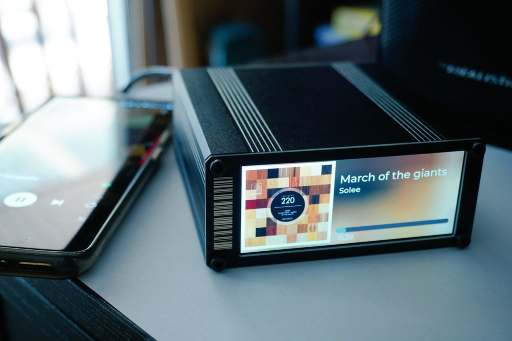
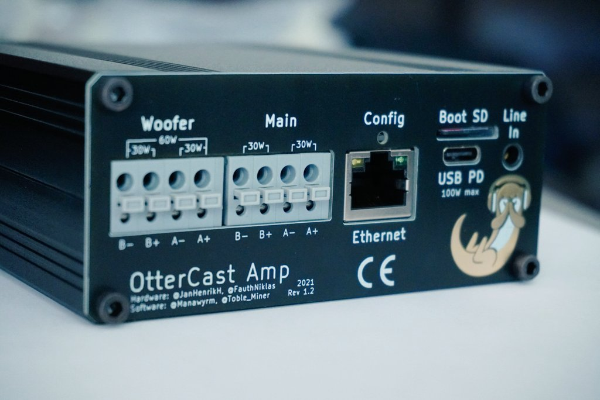
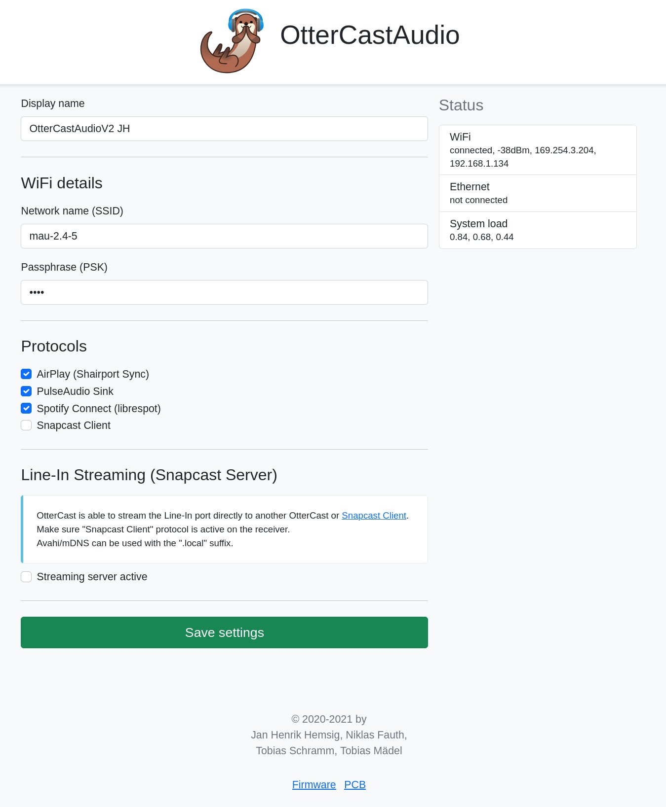
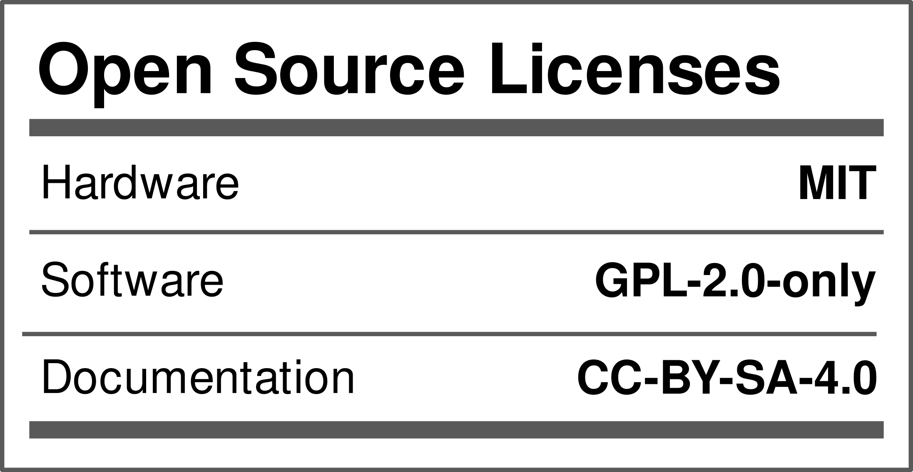

# OtterCastAmp

OtterCastAmp is an open-source Sonos Amp replacement, based on a Sochip S3 SoC and pulseaudio sink/source.

## How do I get one?

We are currently planning a small batch production run, stay tuned.
[editors notes: It is 2024 now and noone really expected how bad covid would affect the supply chain. While all parts are available again, we are only slowly getting interested in this project again]

You don't want to wait? You can of course run a small batch on your own! Please have a look into the [gerber folder](/gerber_v1.2), a batch size of just 5 (and up to 30) boards is supported by JLC.

## Installation & Configuration

After [downloading and flashing](https://cast.otter.jetzt/docs/firmware/#download-ready-made-images) the image, OtterCastAmp can either be configured via the `config.ini` file or via the web-interface.

Check out our [Documentation](https://cast.otter.jetzt/docs/) for more information!

## Schematics?

[Schematics!](/schematic_V1.2/OtterCastAmp.pdf)

## Team

 - [@lucysrausch](https://bsky.app/profile/lucysrausch.bsky.social) Hardware - OtterCastAmp
 - [@_Jana_Marie](https://twitter.com/_Jana_Marie) Hardware - OtterCastAudio
 - [@Toble_Miner](https://twitter.com/Toble_Miner) Software - Embedded Linux
 - [@Manawyrm](https://twitter.com/Manawyrm) Software - Frontend & OTA

## Do you plan a PoE version?

Maybe.
(25W of power is not enough and >50W isn't popular)

## Status

HW v1.0 is ordered and we already found bugs fixed in v1.2 (not ordered yet)
Tested & working:

 - [x] Audio Speaker Out
 - [x] Audio Line In
 - [ ] Bluetooth Audio In
 - [x] USB PD
 - [x] WiFi
 - [x] Ethernet
 - [x] Display
 - [x] Uart

 - [x] Webinterface (config)
 - [x] Shairport-sync
 - [x] Pulseaudio sink
 - [x] Pulseaudio source
 - [x] snapcast

## License

Note: The following files or directories are excluded from the License and are otherwise licensed

 - 3D/
 - datasheets/
