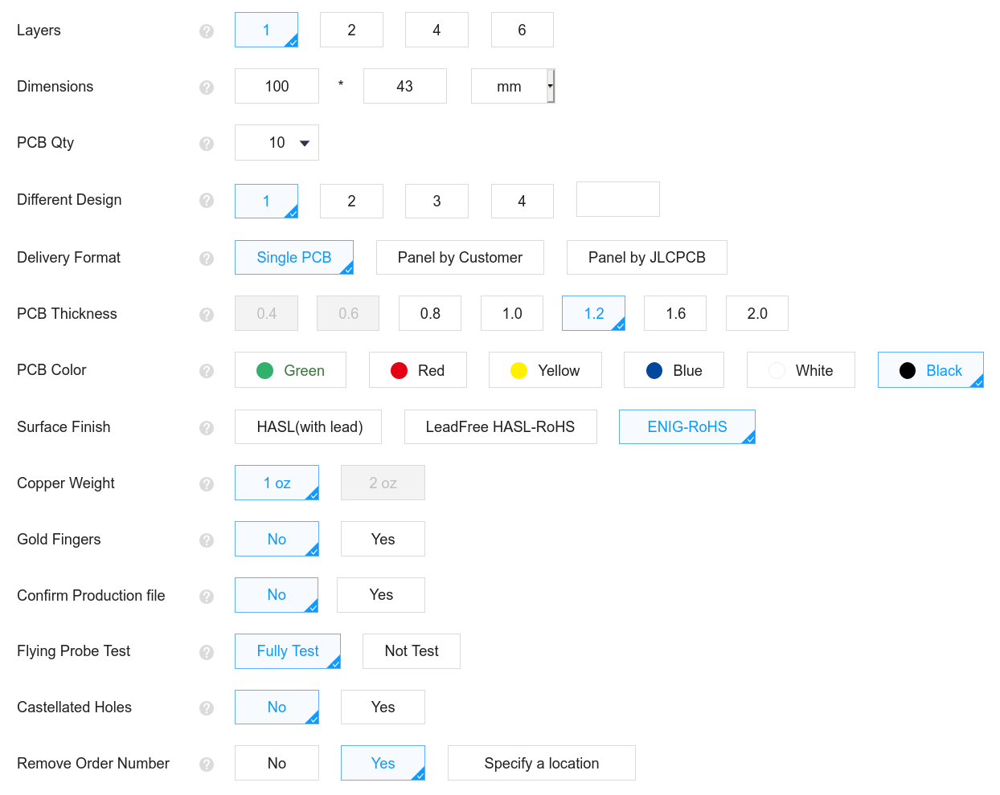

# OtterCastAmp

OtterCastAmp is an open-source Sonos Amp replacement, based on a Sochip S3 SoC and pulseaudio sink/source.

##### Note: ORDER ON YOUR OWN RISK - all bugs are fixed, but the latest version 1.2 has not been tested yet

[Demo](https://twitter.com/Toble_Miner/status/1360255162682638337)

## Status

HW v1.0 is ordered and we already found bugs fixed in v1.2 (not ordered yet)
Tested & working:

 - [x] Audio Speaker Out
 - [x] Audio Line In
 - [ ] Bluetooth Audio In
 - [x] USB PD
 - [x] WiFi
 - [x] Ethernet
 - [ ] Display
 - [x] Uart
 
 - [x] Webinterface (config)
 - [x] Shairport-sync
 - [x] Pulseaudio sink
 - [x] Pulseaudio source
 - [x] snapcast

## Team

*Hardware by:*

[@FauthNiklas](https://twitter.com/FauthNiklas)

[@JanHenrikH](https://twitter.com/JanHenrikH)

*Bringup & Linux build & software by:*

[@Toble_Miner](https://twitter.com/Toble_Miner)

[@Manawyrm](https://twitter.com/Manawyrm)

*Do you plan a PoE version?*

No.
(25W of power is not enough and >50W isn't popular)

## Build Instructions

### Step 1: Get preassembled PCBs from JLCPCB
There are ready-to-order gerber files in this repo. Make sure to choose these settings when ordering the PCBs.

For the front and back PCB, use these settings:

You can use JLCPCB's assembly service to get most parts assembled. With the current supplychain situation, not all parts are available. Some parts can not be assembled by JLCPCB and have to be soldered on manually.

The price for 10pcs assembled PCBs is $30 in PCBs and $200 in parts.

### Step 2: Buy additional parts
You will need:
LCD KD35WVFPD107
https://aliexpress.com/item/4001112368958.html

Allwinner S3
https://aliexpress.com/item/4001284135834.html

## Images

