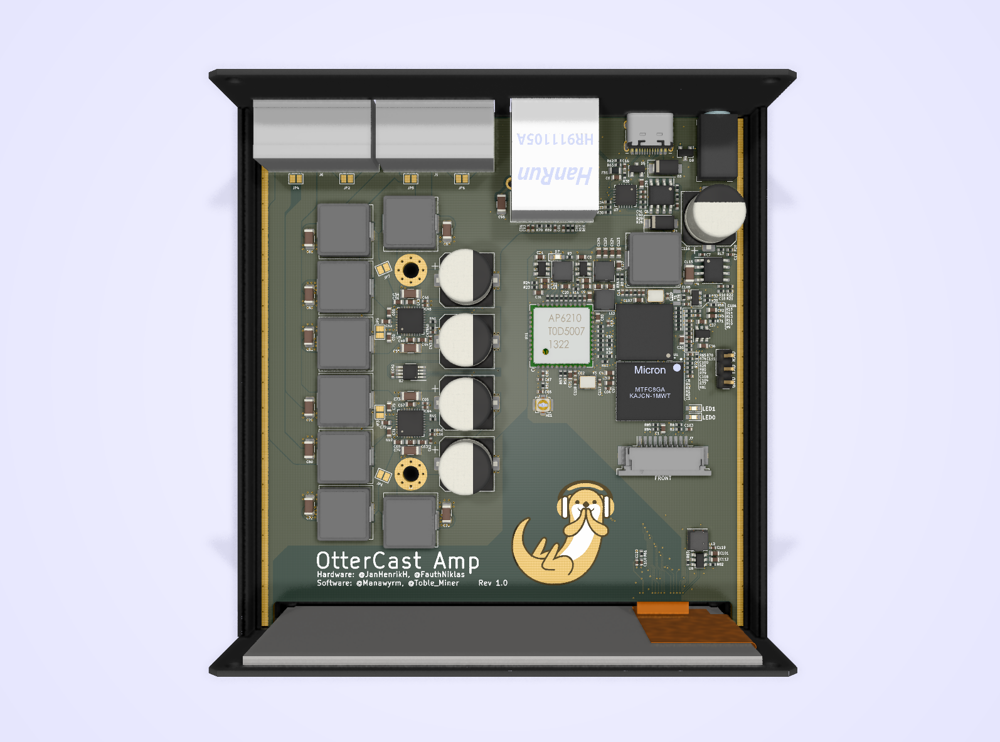

# OtterCastAmp

OtterCastAmp is an open-source Sonos Amp replacement, based on a Sochip S3 SoC and pulseaudio sink/source.

##### Note: DO NOT ORDER/PRODUCE - it still got bugs, this note will disappear when fixed.

[Demo](https://twitter.com/Toble_Miner/status/1360255162682638337)

## Team

*Hardware by:*

[@FauthNiklas](https://twitter.com/FauthNiklas)

[@JanHenrikH](https://twitter.com/JanHenrikH)

*Bringup & Linux build & software by:*

[@Toble_Miner](https://twitter.com/Toble_Miner)

[@Manawyrm](https://twitter.com/Manawyrm)

*Do you plan a PoE version?*

No.
(25W of power is not enough and >50W isn't popular)

## Status

HW v1.0 is ordered and we already found bugs fixed in v1.1 (not ordered yet)
Tested & working:

 - [ ] Audio Speaker Out
 - [ ] Audio Line In
 - [ ] Bluetooth Audio In
 - [ ] USB PD
 - [ ] WiFi
 - [ ] Ethernet
 - [ ] Display
 - [ ] Uart
 
 - [x] Webinterface (config)
 - [x] Shairport-sync
 - [x] Pulseaudio sink
 - [x] Pulseaudio source
 - [x] snapcast

## Images

